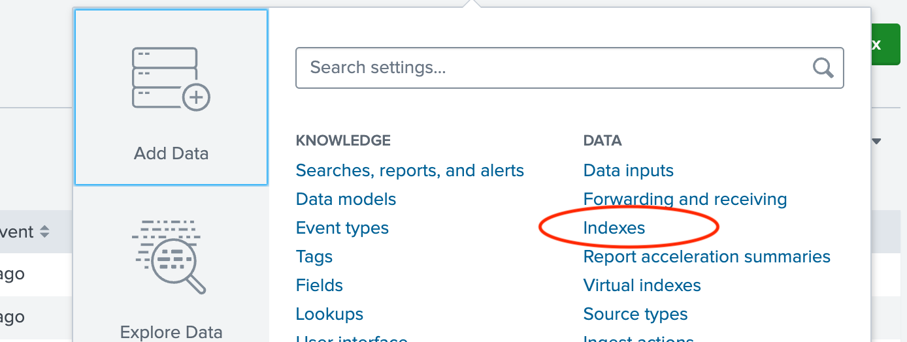
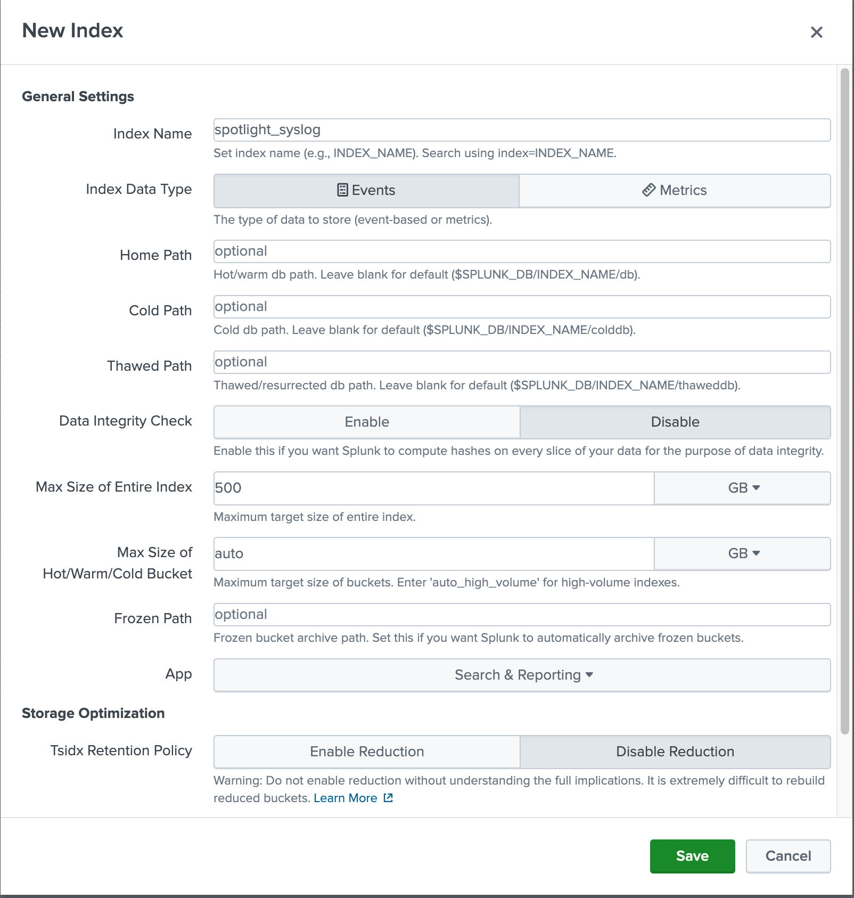
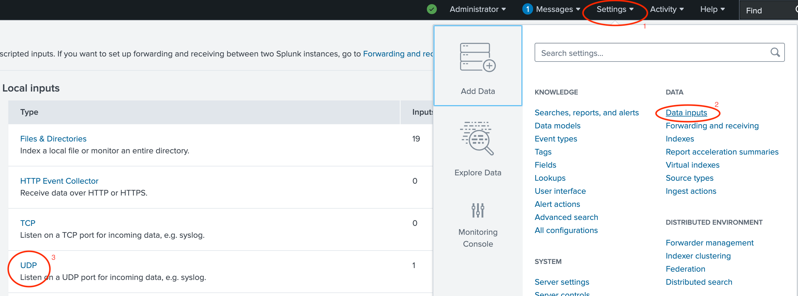
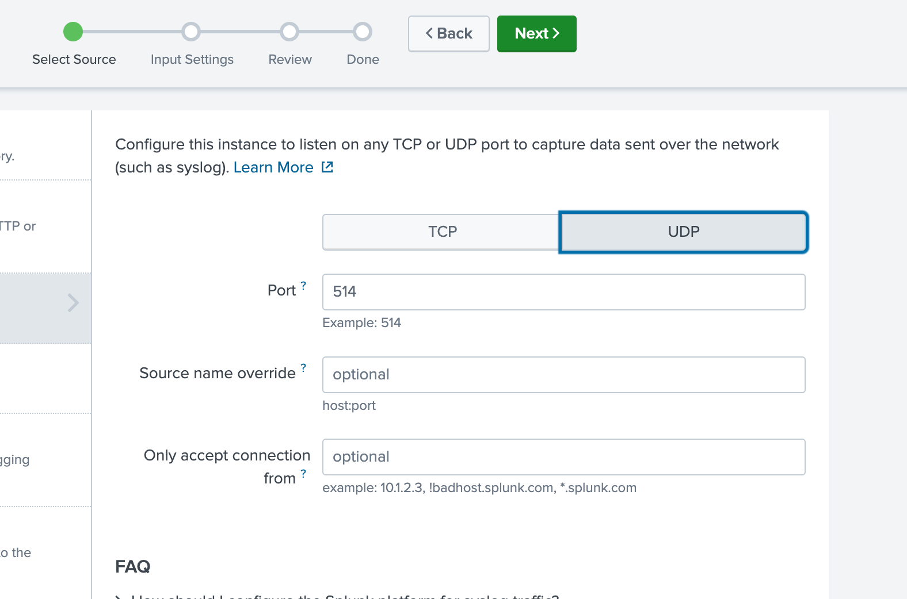
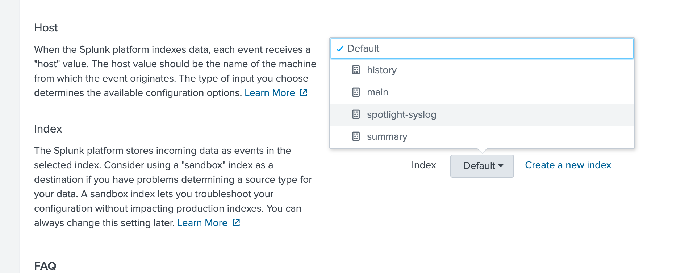
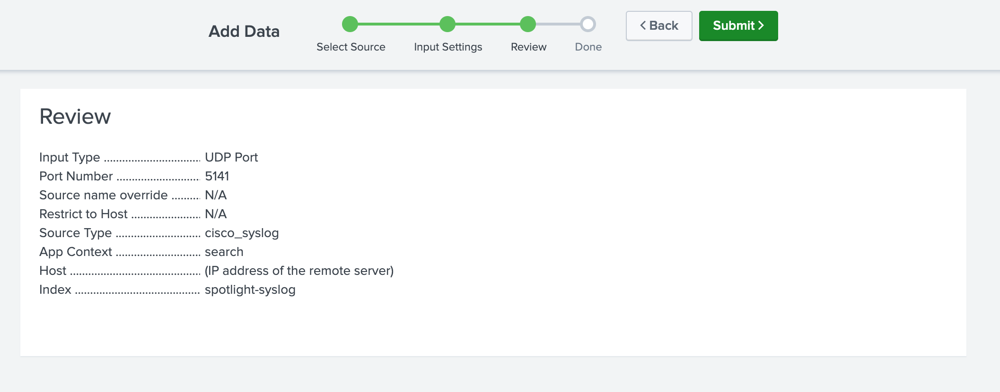

# Installation and Configuration for Syslog Data Ingestion

Syslog is one of the easier network alert data types to receive with Splunk.  In doing so, you are using the native tools and configuration from within Splunk, by creating a listener on a given UDP port and sending that data to a given index.

### Indexes for Data

#### Defining What Requires an Index

Different sets of data can be placed into different indexes, depending on the requirements and needs of your organization.  While the scope of "why" you would do this is beyond the scope of this session, there are a few general best practices:

- **Does the data need to be segmented via Role-Based Access Control (RBAC)?**
  - If the data needs to be segmented from the view of different users, it will need to be placed in a unique index
- **Do unique data retention requirements exist between types of data?**
  - Data retention is defined *per index*, so if there are different requirements, different indexes will be required
- **Do the different data sources have different data volumes?**
  - While not a massive issue, if you have data sources that generate 1000s of events per hour, while another source that generates a few events per day -- you may want to segment the data purely from a refinement and visibility standpoint
- **Does the data being ingested need a different index schema to be appropriately reported?**
  - There are two main index types, **Events** and **Metrics**.  Depending on the data types being received, you may need additional indexes (as events and metrics cannot be ingested by the same index)
  - **Events** indexes are the standard Splunk index, which is meant to store data of actions or results being sent to Splunk.  Think of this as logs or flows, wherein there is some structured data to handle, process, and make available for search
  - **Metrics** indexes are more akin to TSDBs, wherein the data processed is composed of a metric name and a timestamp, with each metric having different "dimensional values" that can be plotted.  Working with **metrics** indexes require the use of statistical searches, rather than the standard **events** searches

Splunk **does not** require different data types/structures to be segmented into different indexes, so that does not need to be a defining factor.

#### Creating the Index

If it is determined that you need a unique index (or want to place the data outside of the default main index), here are the steps required:

1. Click on **Settings > Indexes**



2. Give the new index a name.  You can change the other settings, including size and retention if desired.  Click **Save** when completed



3. The index will now be available for data source ingestion

### Creating a Local Listener (e.g. syslog)

In order to accept data being sent from sources, you need to define data input within the Splunk platform.  This creates the "listener" within Splunk to accept the data being sent to it.

#### Defining a Syslog Listener

To create a syslog listener for splunk (the first part of the demo), perform the following actions:

1. Click on **Settings > Data Inputs > UDP**.  This is due to syslog being sent along a UDP port



2. Click on **New Local UDP**

3. Define the transport type and port number, as well as any overrides necessary.  For syslog, use `udp/514`.  Click **Next**



4. Select the data source type.  In this case, we'll be sending syslog data from Cisco devices, so search for `cisco_syslog` and select that option.  Click **Next** when done


5. Select the index in which you'd like to place the data.  In this case, we're placing it in a net-new index created for the syslog data.  Click **Next** when complete



6. Finally, review the settings to make sure that everything is correct.  Click **Submit** when completed



#### Configuring Cisco IOS for Syslog

For completeness, this step is included.  The configuration snippet is provided from the lab used within the demo, which includes a VRF.  Please modify accordingly to your network environment

```text
logging host 198.18.134.22 vrf MGMT transport udp port 5514
```
